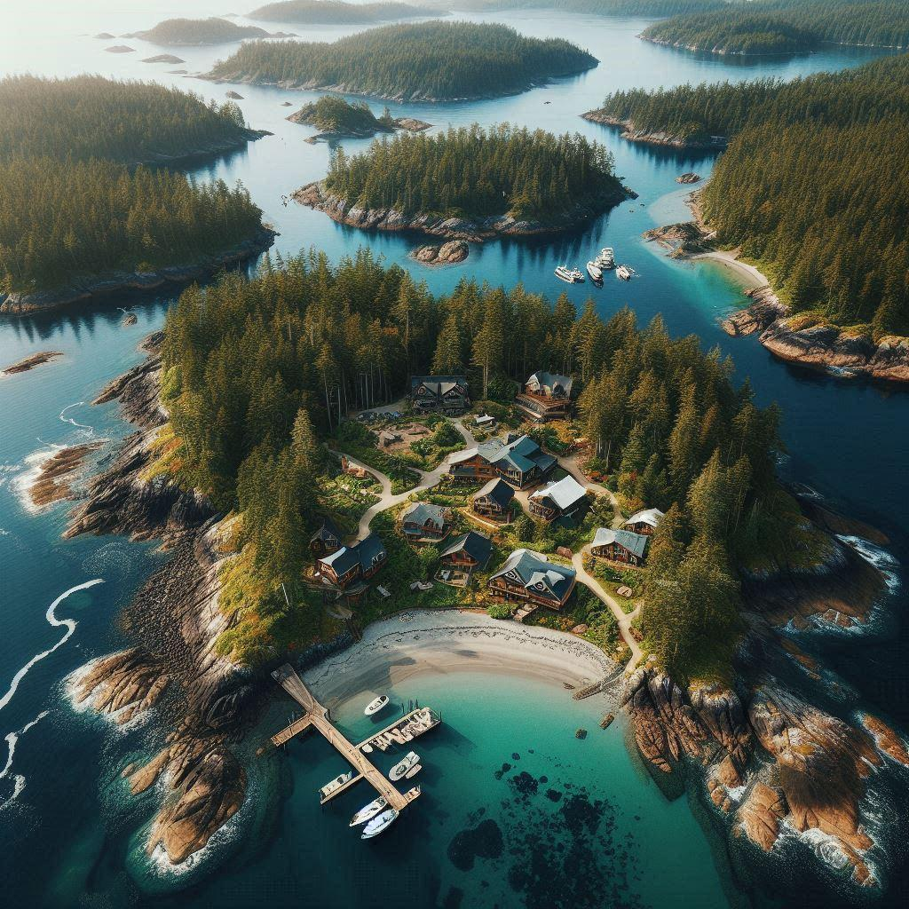

# SnugStoryAI

SnugStoryAI is a comprehensive project that combines a chat application and an island simulation server built with the MERN stack (MongoDB, Express, React, Node.js). This project showcases the integration of various technologies and AI-generated content to create an interactive and dynamic application.

## Table of Contents

- [Features](#features)
- [Installation Guide](#installation-guide)
- [Project Structure](#project-structure)
- [API Documentation](#api-documentation)
- [Usage](#usage)
- [Contributing](#contributing)
- [License](#license)

## Features

- **Chat Application**: Real-time chat functionality with user authentication and avatar settings.
- **Island Simulation**: Create and manage a fictional island with various entities like buildings, characters, and organizations.
- **AI Integration**: Utilize AI to generate descriptive content and automate character creation.
- **Interactive Map**: Visual representation of the island with interactive elements.

## Installation Guide

### Requirements

- [Node.js](https://nodejs.org/en/download)
- [MongoDB](https://www.mongodb.com/docs/manual/administration/install-community/)
- (Optional) [Docker](https://docs.docker.com/get-docker/) and [Docker Compose](https://docs.docker.com/compose/install/)

### Installation

#### First Method: Manual Setup

1. Clone the repository:
    ```sh
    git clone https://github.com/PatrickMurphyDev/SnugStoryAI.git
    cd SnugStoryAI
    ```

2. Rename the environment files:
    ```sh
    cd public
    mv .env.example .env
    cd ../server
    mv .env.example .env
    cd ..
    ```

3. Install dependencies:
    ```sh
    cd server
    yarn
    cd ../public
    yarn
    ```

4. Start the development servers:

    - Frontend:
        ```sh
        cd public
        yarn start
        ```

    - Backend (in a separate terminal):
        ```sh
        cd server
        yarn start
        ```

    Open `localhost:3000` in your browser.

#### Second Method: Docker Setup

1. Ensure Docker and Docker Compose are installed.
2. Build and start the containers:
    ```sh
    docker compose build --no-cache
    docker compose up
    ```
3. Open `localhost:3000` in your browser.

## Project Structure

### Key Directories and Files

- `Documentation`: Contains logs and documentation related to the GPT integration.
- `IslandCommunityDataServer`: Backend server for the island simulation, including API files, models, and data collections.
- `public`: Frontend React application.
- `server`: Express server setup with controllers, models, and routes for handling backend operations.

## API Documentation

API documentation for various endpoints can be found in the `IslandCommunityDataServer/docs` directory. For example, the `/areas` endpoint documentation is available in `areas.html`.

## Usage

1. **Chat Application**: Access via the main page at `localhost:3000`. Users can register, login, and start chatting.
2. **Island Simulation**: Navigate to the map view (`/map`) to interact with the island simulation. You can view and manage various entities like buildings and characters.

## Contributing

We welcome contributions! Please fork the repository and submit pull requests for any enhancements or bug fixes.

1. Fork the repository.
2. Create a new branch (`git checkout -b feature/your-feature`).
3. Commit your changes (`git commit -m 'Add your feature'`).
4. Push to the branch (`git push origin feature/your-feature`).
5. Open a pull request.

## License

This project is licensed under the MIT License