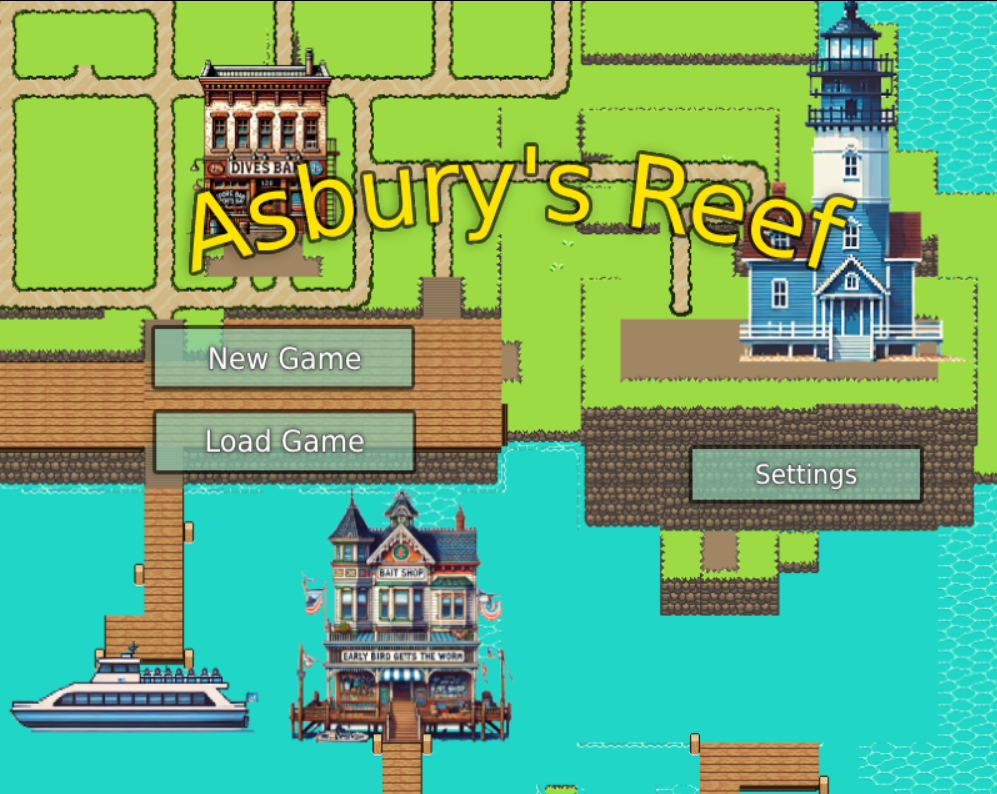
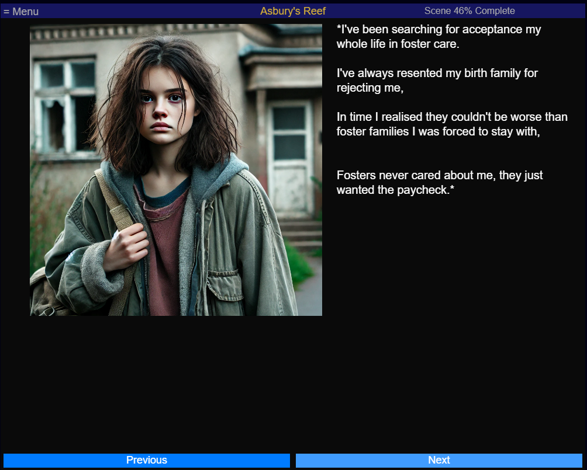
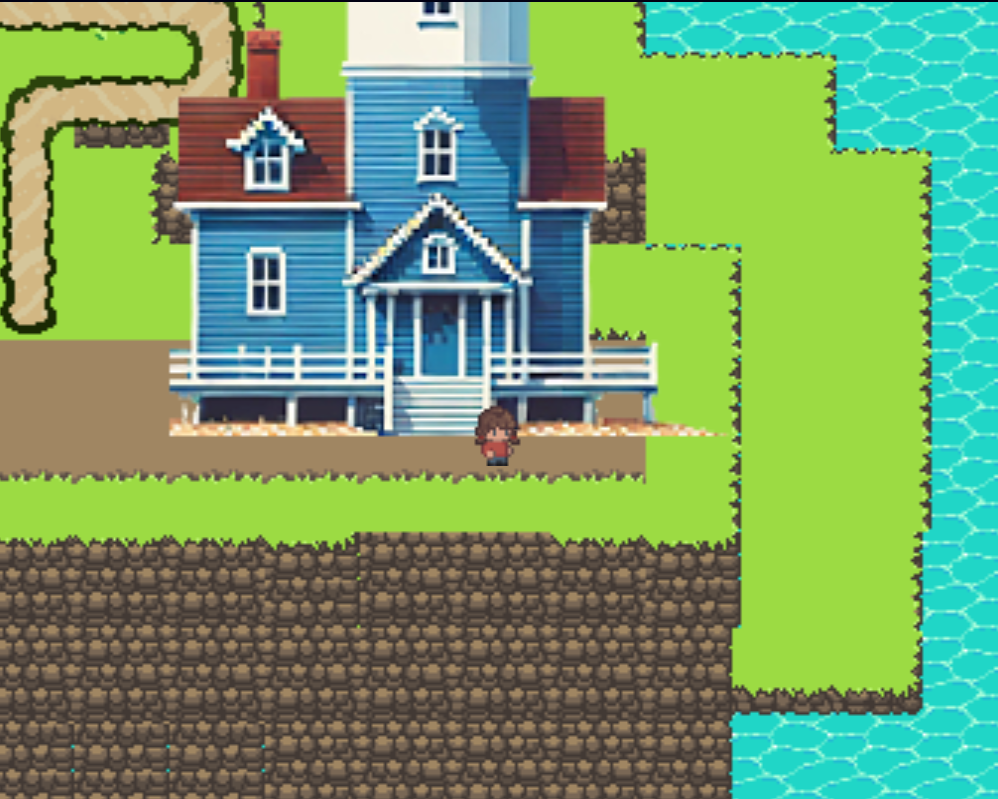
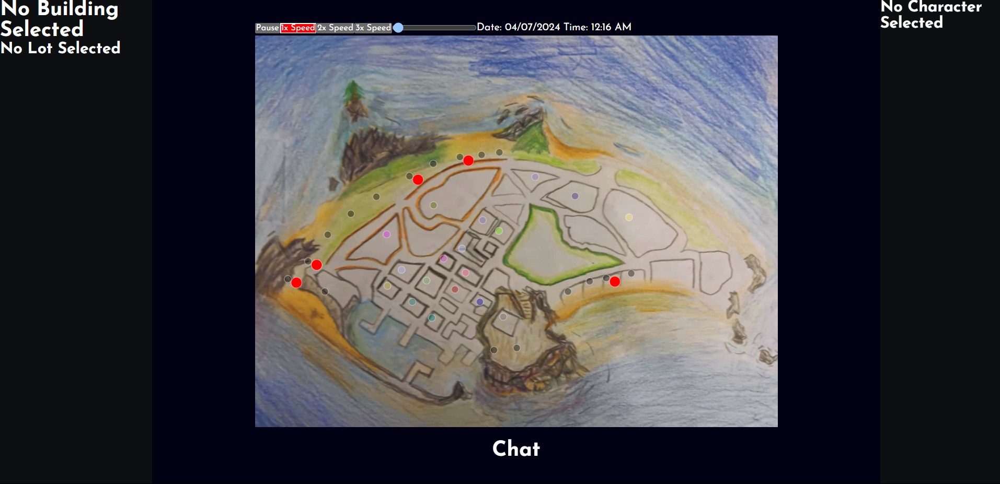
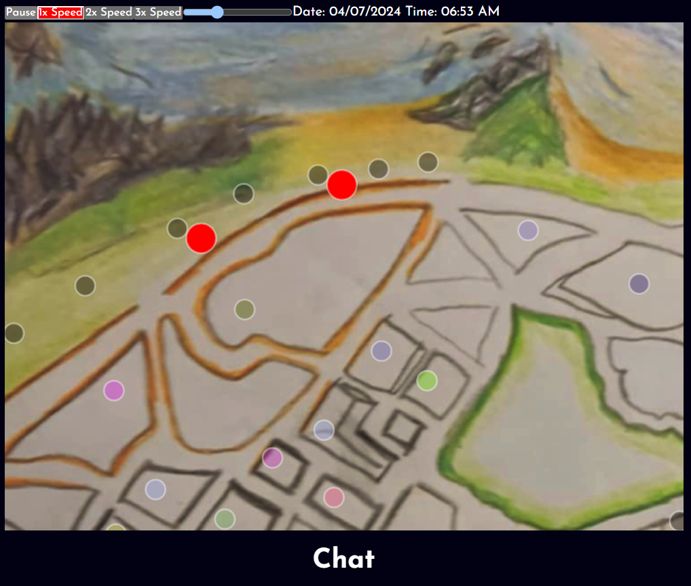

# SnugStoryAI

*Concept Art*

SnugStoryAI is a comprehensive project that combines a chat application and an island simulation server built with the MERN stack (MongoDB, Express, React, Node.js). This project showcases the integration of various technologies and AI-generated content to create an interactive and dynamic application.

## Table of Contents

- [Features](#features)
- [Project Structure](#project-structure)
- [API Documentation](#api-documentation)
- [Usage](#usage)
- [Contributing](#contributing)
- [License](#license)

## Screenshots

## Features

- **Chat Application**: Real-time chat functionality with user authentication and avatar settings.
- **Island Simulation**: Create and manage a fictional island with various entities like buildings, characters, and organizations.
- **AI Integration**: Utilize AI to generate descriptive content and automate character creation.
- **Interactive Map**: Visual representation of the island with interactive elements.

### About Design Concepts

### Character Development
- **Initial Desire**: What does your character want before the story begins? How does the inciting incident change their desires?
- **Motivation**: What drives your character to pursue their goal despite hardships? 
- **Goal Significance**: What will achieving this goal mean to your character? How will it affect their life?
- **Obstacles**: What stands in your character's way externally and internally?
- **Internal Conflict**: How does the character’s backstory influence their internal conflicts?
- **Consequences**: What does your character have to lose or gain? What’s at stake in achieving their goal?

### World Details
- **Island Layout**: Detailed description of the island's geography and notable features.
- **Buildings**: List of key buildings, their industry categories, job positions, and services offered.
- **Wildlife**: Description of marine animals, birds, terrestrial animals, and invertebrates found around the island.

### Relationship Stages
- **Initial Meeting**: Two individuals meet for the first time.
- **Casual Dating**: Informal relationship exploring interest and compatibility.
- **Exclusive Dating**: Relationship becomes exclusive.
- **Official Relationship**: Formal acknowledgment of the relationship.
- **Deepening Connection**: Partners develop a deeper bond.
- **Engagement and Marriage**: Long-term commitment planning and formalization.

## Old Screenshots

## Project Structure

    SnugStoryAI/
    ├── Documentation/
    │ ├── DesignDocument/
    │ └── GPT/
    │ └── GPTLogs/
    ├── IslandCommunityDataServer/
    │ ├── APIFiles/
    │ ├── Model/
    │ ├── ModelDefinitions/
    │ ├── build_scripts/
    │ ├── data_collections/
    │ ├── docs/
    │ └── public/
    ├── public/
    │ ├── src/
    │ ├── public/
    │ ├── Dockerfile
    │ └── README.md
    ├── server/
    │ ├── controllers/
    │ ├── models/
    │ ├── routes/
    │ ├── sockets/
    │ ├── Dockerfile
    │ └── index.js
    └── README.md

### P5.js IslandSketch Component Structure

    SnugStoryAI/
    ├── public/
    │ ├── src/
        ├── Entities/
        │ ├── controllers/
    │ ├── public/
        ├── Images/

### Key Directories and Files

- `Documentation`: Contains logs and documentation related to the GPT integration.
- `IslandCommunityDataServer`: Backend server for the island simulation, including API files, models, and data collections.
- `public`: Frontend React application.
- `server`: Express server setup with controllers, models, and routes for handling backend operations.

## API Documentation

API documentation for various endpoints can be found in the `IslandCommunityDataServer/docs` directory. For example, the `/areas` endpoint documentation is available in `areas.html`.

## Usage

1. **Start Application**: Access via the main page at `localhost:3000`. Users can register, login, and start chatting.
2. **Chat Application**: Access via the main page at `localhost:3000`. Users can register, login, and start chatting.
3. **Island Simulation**: Navigate to the map view (`/map`) to interact with the island simulation. You can view and manage various entities like buildings and characters.

## Contributing

We welcome contributions! Please fork the repository and submit pull requests for any enhancements or bug fixes.

1. Fork the repository.
2. Create a new branch (`git checkout -b feature/your-feature`).
3. Commit your changes (`git commit -m 'Add your feature'`).
4. Push to the branch (`git push origin feature/your-feature`).
5. Open a pull request.

## License

This project is licensed under the MIT License
